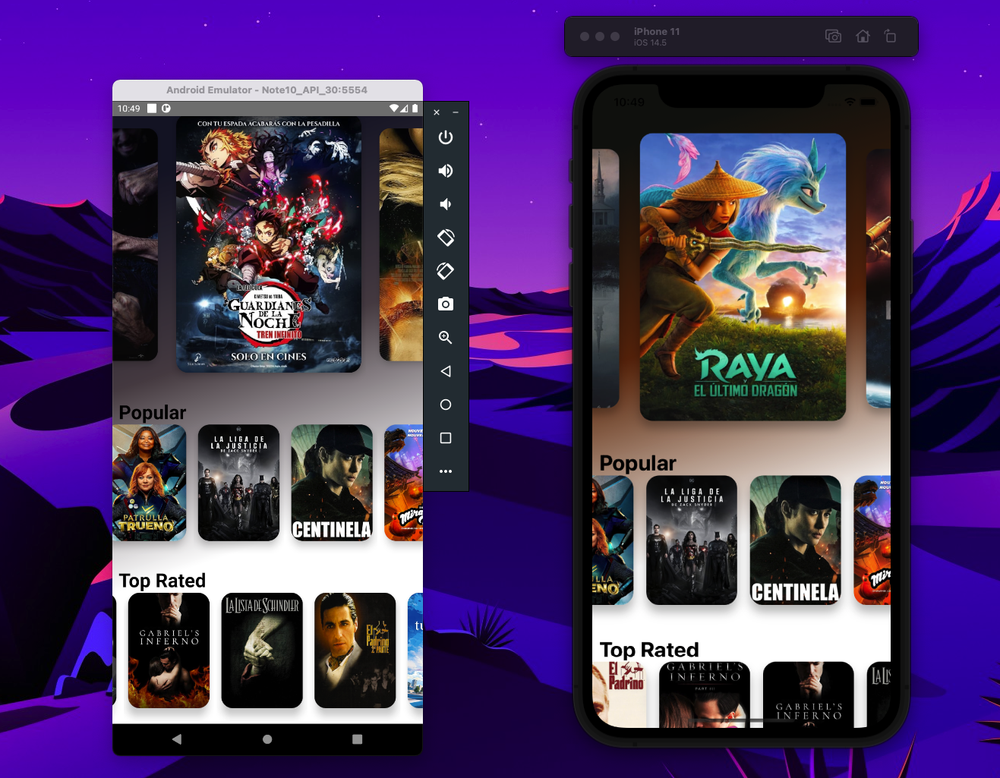

    <h1>Movie React Native</h1>

## Movie App made in React Native, from Fernando Herrara's course in which I learned concepts such as:
* Navigation between screens
* Api Axios
* Card carousel
* Multiple requests as synchronous simultaneously
* FadeIn and FadeOut animation
* Gradient Background
* Use of custom hooks
* Using Context for color gradient

-----------------------------------------
## Español
## App de Peliculas realizada en React Native , del curso de Fernando Herrara en el cual aprendí conceptos como:
* Navegación entre pantallas
* Api Axios
* Carousel de tarjetas
* Multiples peticiones asincronas de forma simultanea
* FadeIn y FadeOut animacion
* Fondo con Gradiente
* Uso de hook personalizados
* Uso de Context para gradiente de color

# Video demostración:
[Youtube](https://www.youtube.com/watch?v=Bgb82cCue1g)

## Mi canal de youtube 

[Youtube](https://www.youtube.com/channel/UCQsrs_h91Q-baLx-n_rcdNg)

## Mis articulos en medium
[medium](https://devjaime.medium.com/)

## Mi twitter por si quieres contacterme
[medium](https://twitter.com/HsJhernandez)

### :heart: ¿Te gusto este proyecto?

Si te gusto este proyecto comparte y dale una estrella :star: en Github y no dudes en contactarme.